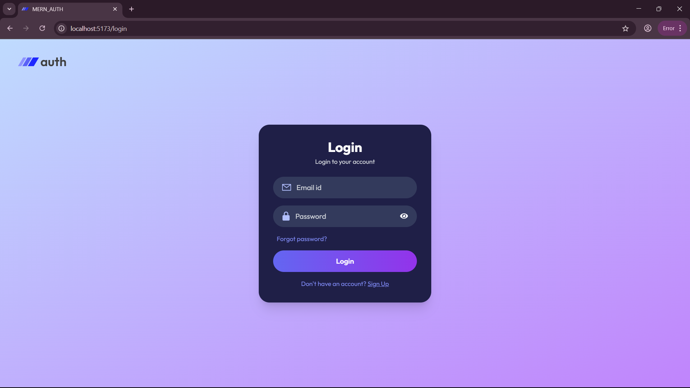
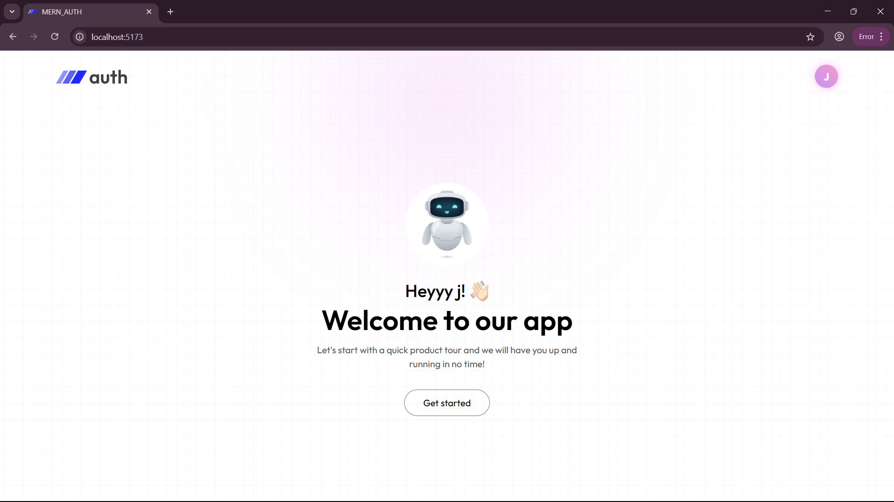
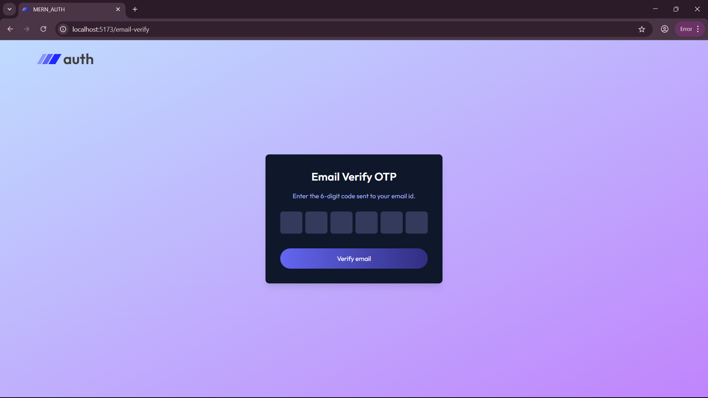
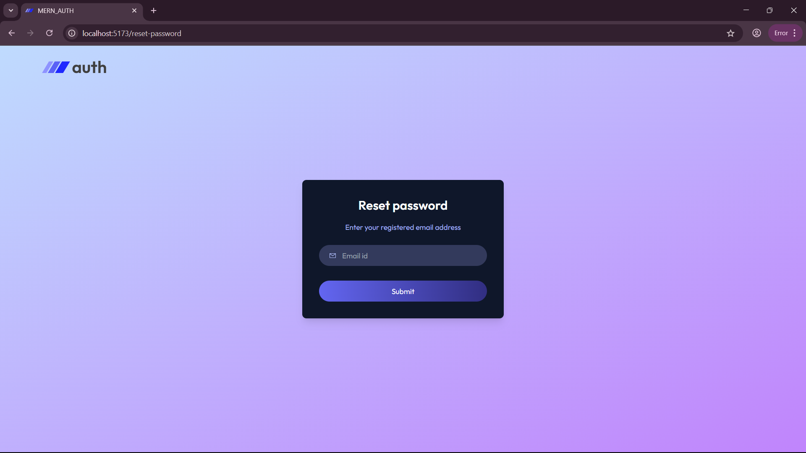

# MERN Authentication System 🔐


A complete MERN (MongoDB, Express, React, Node.js) based authentication system with:

- JWT-based login
- Email verification via OTP (6-digit)
- OTP expiry logic
- Protected routes
- Password hashing with bcrypt
- Cookies for session persistence
- Full frontend and backend integration

---

## 📁 Project Structure

```bash
    MERN_Auth/
    ├── client/ # React Frontend (Vite)
    │ ├── src/
    │ │ ├── components/ # Auth, Dashboard, Navbar, OTP
    │ │ ├── App.jsx
    │ │ ├── main.jsx
    │ ├── package.json
    ├── server/ # Node.js + Express Backend
    │ ├── controllers/
    │ ├── middleware/
    │ ├── models/
    │ ├── routes/
    │ ├── utils/
    │ ├── config/
    │ ├── server.js
    │ ├── .env
    │ ├── package.json
```

## 🚀 Features

- ✅ **User Registration**
- ✅ **Login with JWT + HttpOnly Cookie**
- ✅ **Email OTP Verification** (6 digits)
- ✅ **OTP Expiry in 5 Minutes**
- ✅ **Resend OTP**
- ✅ **Protected Dashboard**
- ✅ **Logout**
- ✅ **Forgot Password (OTP + Reset Flow)** – _Optional/Planned_


## ⚙️ Installation & Setup

### 📦 Backend

```bash
cd server
npm install
```

# Create a .env file inside server/:

```bash 
PORT=4000
MONGO_URL=mongodb://localhost:27017/mern-auth
JWT_SECRET=your_jwt_secret_key
```

# Then start the backend server:

```bash
npm run start
```

### 🌐 Frontend

```bash
cd client
npm install
npm run dev
```

- Frontend will run on: http://localhost:5173

## 🛡️ Routes Overview

# 🔐 Auth Routes (/api/auth)

```bash 
| Route              | Method | Description                  |
| ------------------ | ------ | ---------------------------- |
| `/register`        | POST   | Register user                |
| `/login`           | POST   | Login user and return JWT    |
| `/logout`          | GET    | Clear token and logout       |
| `/send-verify-otp` | POST   | Send OTP to email            |
| `/verify-email`    | POST   | Verify OTP and activate user |
```

## 🔑 API Routes

```bash 
📌 POST /api/auth/register

- Register user

- Returns cookie + message

- Sends OTP to email (console log in dev)

📌 POST /api/auth/login

- Authenticates and sets JWT cookie

📌 GET /api/auth/user

- Returns current user info (if logged in)

📌 POST /api/auth/send-verify-otp

- Sends 6-digit OTP (stored in DB)

📌 POST /api/auth/verify-email

- Verifies OTP and activates account

📌 GET /api/auth/logout

- Clears JWT cookie
```

## 📷 Screenshots








## 🧪 Tech Stack

- Frontend: React + Vite

- Backend: Express.js + Node.js

- Database: MongoDB + Mongoose

- Authentication: JWT + bcrypt

- Email OTP: In-Console (can integrate real email sender)

- Session: HttpOnly Cookies

## 🖼️ UI Pages

- ✅ Login

- ✅ Register

- ✅ Email Verification (OTP input with 6 boxes)

- ✅ Dashboard

- ✅ Navbar with conditional links

## 📝 Notes

- OTP is valid for 5 minutes

- OTP is currently logged in console — you can integrate Nodemailer for email delivery

- JWT is stored in HttpOnly cookies (secure and cannot be accessed via JS)

- isAccountVerified field in DB is used to block unverified access

